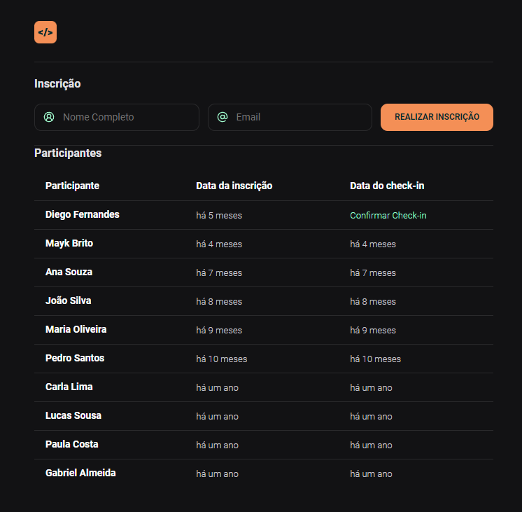

# Formulário de inscrição

Projeto desenvolvido com HTML, CSS e Javascript no evento da empresa Rocketseat. Apresenta uma lista de participantes inscritos num evento fictício, permitindo ao usuário inserir nome e email para realizar a inscrição também. Com o nome na lista é possível confirmar o check-in. Foi adicionada uma etapa de validação para que emails já cadastrados não possam ser cadastrados novamente.

Esse projeto desenvolve o uso de formulários e do objeto Date do Javascript.

